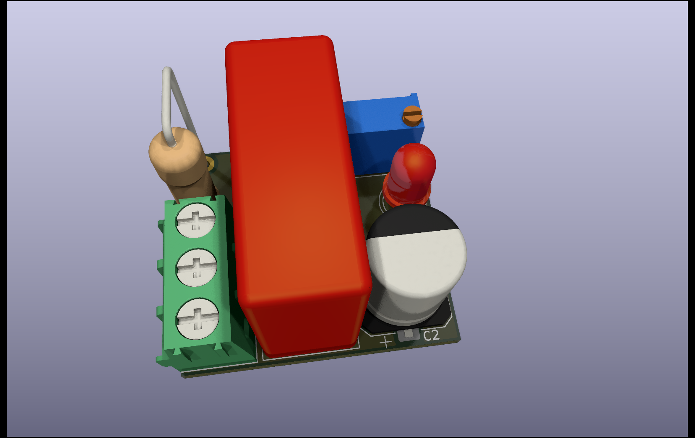
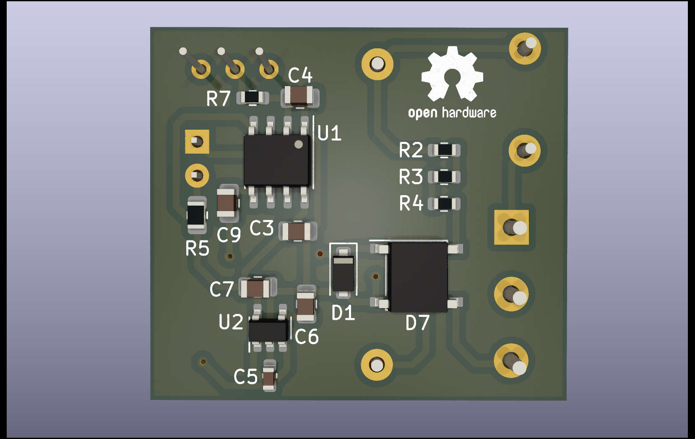
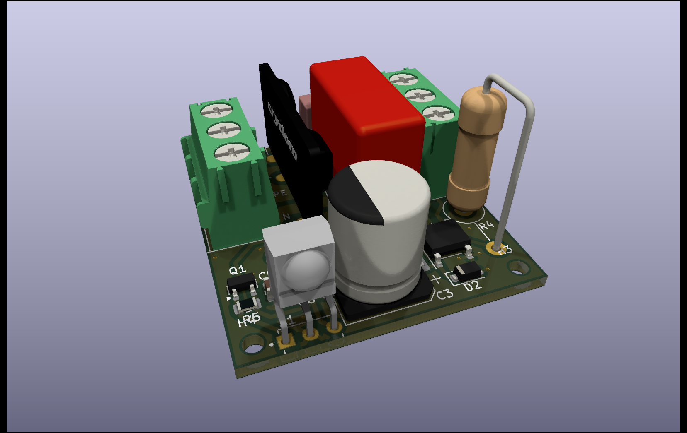

# IR-based remote AC switch
This projects aims to remote control an AC power socket. It features two PCBs with one being an IR emitter controlled by an AC input and a receiver/switch that turns on power if the IR signal is received.

The motivation to build this was an existing power outlet at the ceiling of our kitchen being controlled by a wall switch which I wanted to use to switch another lighting device in the room powered from a wall socket.
The emitter is mounted at the ceiling outlet and turned on once the wall switch was used. The receiver then turns on the lighting device at the other end of the room as long as the emitter keeps signalling.

## Circuits
Both circuits implement a capacitor power supply, as only a few mA of current are reqired to either drive an LED and a signal generator (emitter) or the IR receiver and a solid state relay (switch). The capacitor PSU is tolerant up to 230V AC.

The IR signal is pulsed at 38kHz and can be tuned using a potentiometer on the emitter's side. The signal is generated using a simple 555 circuit.

If you want to enclose the receiver/switch, there's a [case available to 3D print](case/case.3mf).

## Safety note
I am no electronics specialist and can not guarantee for the safety of these devices. If you want to build these for yourself be aware that you'll be working with mains voltage which can be potentially deadly when handled without care! Use at your own risk.

The PCBs have been prototyped at AISLER:
* [switch](https://aisler.net/p/HPFIOOUA)
* [emitter](https://aisler.net/p/JRNHJFBC)
